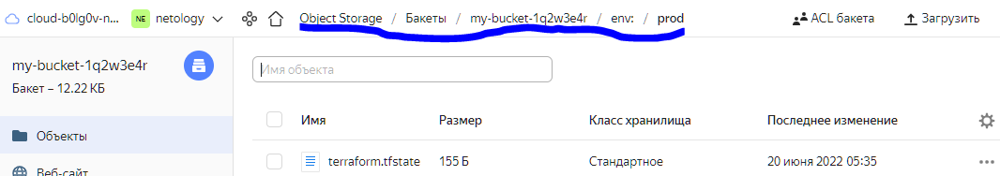
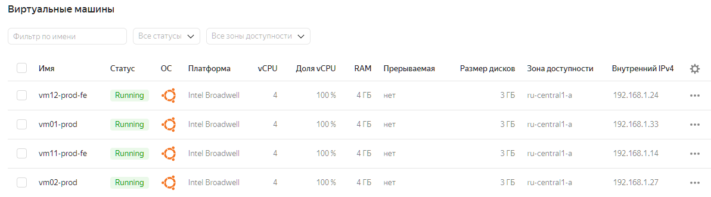
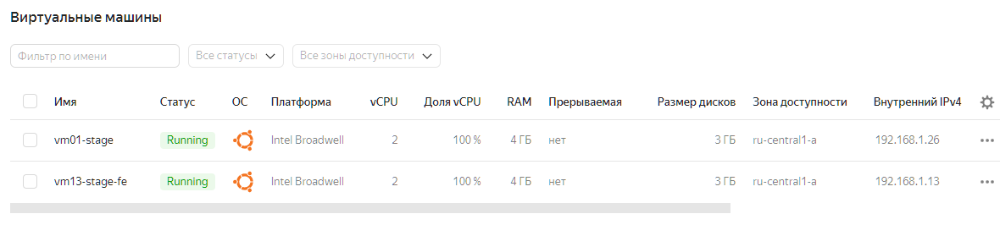

# Домашнее задание к занятию "7.3. Основы и принцип работы Терраформ"


---

В данном файле приведены **только ответы** ! Т.е. можно искать по **Ответ:**

Задание сделано на **YandexCloud**.

---


## Задача 1. Создадим бэкэнд в S3 (необязательно, но крайне желательно).

Если в рамках предыдущего задания у вас уже есть аккаунт AWS, то давайте продолжим знакомство со взаимодействием
терраформа и aws. 

1. Создайте s3 бакет, iam роль и пользователя от которого будет работать терраформ. Можно создать отдельного пользователя,
а можно использовать созданного в рамках предыдущего задания, просто добавьте ему необходимы права, как описано 
[здесь](https://www.terraform.io/docs/backends/types/s3.html).

Используем настроенную сервисную роль из предыдущего ДЗ.

[РУКОВОДСТВО для YC](https://cloud.yandex.ru/docs/storage/operations/buckets/create)
Для использования bucket нужно создать пару access_key, secret_key :
```bash
yc iam service-account list
+----------------------+----------+
|          ID          |   NAME   |
+----------------------+----------+
| ajechqphtu7nm44c16l8 | netology |
+----------------------+----------+


yc iam access-key create --service-account-name netology --description "key for my-bucket"


access_key:
  id: ajeklrv9f1n8hqotgq65
  service_account_id: ajechqphtu7nm44c16l8
  created_at: "2022-06-20T00:10:48.946063819Z"
  description: key for my-bucket
  key_id: 
secret: 
```

Добавляем в файл `main.tf` :
```yaml
resource "yandex_storage_bucket" "my-bucket-1q2w3e4r" {
  access_key =  #key_id "<идентификатор статического ключа>"
  secret_key =  #secret "<секретный ключ>"
  bucket     = "my-bucket-1q2w3e4r"
}
```

---

2. Зарегистрируйте бэкэнд в терраформ проекте как описано по ссылке выше.
[РУКОВОДСТВО для YC](https://cloud.yandex.ru/docs/tutorials/infrastructure-management/terraform-state-storage)
Добавляем в файл `main.tf` :
```yaml
terraform {
  ...
  backend "s3" {
    endpoint   = "storage.yandexcloud.net"
    bucket     = "my-bucket-1q2w3e4r"
    region     = "ru-central1"
    key        = "./terraform.tfstate"
    access_key = "YCAJEuU0nHfzi4MbHMOq2bQk_"
    secret_key = "YCMcKQkucbJ3ThlyBoTEf42kfwLjLkT9FTUUUJdt"

    skip_region_validation      = true
    skip_credentials_validation = true
  }
}
```

---

## Задача 2. Инициализируем проект и создаем воркспейсы. 

1. Выполните `terraform init`:
    * если был создан бэкэнд в S3, то терраформ создат файл стейтов в S3 и запись в таблице 
dynamodb.
    * иначе будет создан локальный файл со стейтами.  
2. Создайте два воркспейса `stage` и `prod`.

```bash
terraform workspace new stage
terraform workspace new prod
```
*По-умолчанию переключены уже на крайний-  на `prod`

---

3. В уже созданный `aws_instance` добавьте зависимость типа инстанса от вокспейса, что бы в разных ворскспейсах 
использовались разные `instance_type`.
4. Добавим `count`. Для `stage` должен создаться один экземпляр `ec2`, а для `prod` два.

Добавляем в файл `main.tf` :
```yaml
locals {
  instance_type_w = {
    stage = "standard-v1"
    prod = "standard-v3"
  }
  instance_count_w={
    stage=1
    prod=2
  }
...
}

resource "yandex_compute_instance" "vm_count" {
  count=local.instance_count_w[terraform.workspace] #"${terraform.workspace == "prod" ? 2 : 1}"
  platform_id=local.instance_type_w[terraform.workspace]
...
}
```

---

5. Создайте рядом еще один `aws_instance`, но теперь определите их количество при помощи `for_each`, а не `count`.

Придумал только по-примеру [terraform FOR_EACH](https://www.terraform.io/language/meta-arguments/for_each)
Добавляем в файл `main.tf` :
```yaml
variable "vms" {
  type=map
  default = {
    prod={
      vm11 = {
        name="vm11-prod-fe"
        cores=4
      }
      vm12={
        name="vm12-prod-fe"
        cores=4
      }
    }
    stage={
      vm13 ={
        name="vm13-stage-fe"
        cores=2
      }
    }
  }
}

resource "yandex_compute_instance" "vm_for_each" {
  for_each = var.vms[terraform.workspace]
  name=each.value.name
...

}
```

---

6. Что бы при изменении типа инстанса не возникло ситуации, когда не будет ни одного инстанса добавьте параметр
жизненного цикла `create_before_destroy = true` в один из рессурсов `aws_instance`.

```yaml
resource "yandex_compute_instance" "vm_for_each" {
  for_each = var.vms[terraform.workspace]
  name=each.value.name
...
  lifecycle {
    create_before_destroy = true
  }
}
```

7. При желании поэкспериментируйте с другими параметрами и рессурсами.


---

В виде результата работы пришлите:
* Вывод команды `terraform workspace list`.

**Ответ:**
```bash
PS C:\Users\Денис\PycharmProjects\virt-homeworks\07-terraform-03-basic\src\terraform> terraform workspace list
  default
* prod
  stage

```

---

* Вывод команды `terraform plan` для воркспейса `prod`.  

**Ответ:**
```bash
PS C:\Users\Денис\PycharmProjects\virt-homeworks\07-terraform-03-basic\src\terraform> terraform plan

Terraform used the selected providers to generate the following execution plan. Resource actions are indicated with the following symbols:
  + create

Terraform will perform the following actions:

  # yandex_compute_instance.vm_count[0] will be created
  + resource "yandex_compute_instance" "vm_count" {
      + created_at                = (known after apply)
      + folder_id                 = (known after apply)
      + fqdn                      = (known after apply)
      + hostname                  = (known after apply)
      + id                        = (known after apply)
      + metadata                  = {
          + "ssh-keys" = <<-EOT
                ubuntu:ssh-rsa AAAAB3NzaC1yc2EAAAADAQABAAABAQDEPm+JnFr+srmrCQnvFWAxHMGSb8MEemh4Bbt3Kt2Qnri2qZd/YSS135tF2onhnqawmBZpwv+dmbAVdnbcvu3hyJBMTCp
PzmSsjyYzwGnQ6WuP0C839vYsudbQOMcS2mPjXlNobyxNDl/gBYIU2cb3W5FX923H0jD3SfhUzxekfsT1ab6auokyGC1LZbS5mMONQeyvsqlJdwNapE6xfgevnYWzeu9BEiyTvZl12FKoZ6TSB0LBf9/gH
QCyxNhpVz9tu/aQT0CZqRZYAoncejR54rzqukrgU14zGjn7oCk/FW3qXLXXyCMSZjusKTAneawt4BWTMwnB3vYGovUrm9Sx vagrant@vagrant
            EOT
        }
      + name                      = "vm01-prod"
      + network_acceleration_type = "standard"
      + platform_id               = "standard-v1"
      + service_account_id        = (known after apply)
      + status                    = (known after apply)
      + zone                      = (known after apply)

      + boot_disk {
          + auto_delete = true
          + device_name = (known after apply)
          + disk_id     = (known after apply)
          + mode        = (known after apply)

          + initialize_params {
              + block_size  = (known after apply)
              + description = (known after apply)
              + image_id    = "fd81hgrcv6lsnkremf32"
              + name        = (known after apply)
              + size        = (known after apply)
              + snapshot_id = (known after apply)
              + type        = "network-hdd"
            }
        }

      + network_interface {
          + index              = (known after apply)
          + ip_address         = (known after apply)
          + ipv4               = true
          + ipv6               = (known after apply)
          + ipv6_address       = (known after apply)
          + mac_address        = (known after apply)
          + nat                = true
          + nat_ip_address     = (known after apply)
          + nat_ip_version     = (known after apply)
          + security_group_ids = (known after apply)
          + subnet_id          = (known after apply)
        }

      + placement_policy {
          + host_affinity_rules = (known after apply)
          + placement_group_id  = (known after apply)
        }

      + resources {
          + core_fraction = 100
          + cores         = 4
          + memory        = 4
        }

      + scheduling_policy {
          + preemptible = (known after apply)
        }
    }

  # yandex_compute_instance.vm_count[1] will be created
  + resource "yandex_compute_instance" "vm_count" {
      + created_at                = (known after apply)
      + folder_id                 = (known after apply)
      + fqdn                      = (known after apply)
      + hostname                  = (known after apply)
      + id                        = (known after apply)
      + metadata                  = {
          + "ssh-keys" = <<-EOT
                ubuntu:ssh-rsa AAAAB3NzaC1yc2EAAAADAQABAAABAQDEPm+JnFr+srmrCQnvFWAxHMGSb8MEemh4Bbt3Kt2Qnri2qZd/YSS135tF2onhnqawmBZpwv+dmbAVdnbcvu3hyJBMTCp
PzmSsjyYzwGnQ6WuP0C839vYsudbQOMcS2mPjXlNobyxNDl/gBYIU2cb3W5FX923H0jD3SfhUzxekfsT1ab6auokyGC1LZbS5mMONQeyvsqlJdwNapE6xfgevnYWzeu9BEiyTvZl12FKoZ6TSB0LBf9/gH
QCyxNhpVz9tu/aQT0CZqRZYAoncejR54rzqukrgU14zGjn7oCk/FW3qXLXXyCMSZjusKTAneawt4BWTMwnB3vYGovUrm9Sx vagrant@vagrant
            EOT
        }
      + name                      = "vm02-prod"
      + network_acceleration_type = "standard"
      + platform_id               = "standard-v1"
      + service_account_id        = (known after apply)
      + status                    = (known after apply)
      + zone                      = (known after apply)

      + boot_disk {
          + auto_delete = true
          + device_name = (known after apply)
          + disk_id     = (known after apply)
          + mode        = (known after apply)

          + initialize_params {
              + block_size  = (known after apply)
              + description = (known after apply)
              + image_id    = "fd81hgrcv6lsnkremf32"
              + name        = (known after apply)
              + size        = (known after apply)
              + snapshot_id = (known after apply)
              + type        = "network-hdd"
            }
        }

      + network_interface {
          + index              = (known after apply)
          + ip_address         = (known after apply)
          + ipv4               = true
          + ipv6               = (known after apply)
          + ipv6_address       = (known after apply)
          + mac_address        = (known after apply)
          + nat                = true
          + nat_ip_address     = (known after apply)
          + nat_ip_version     = (known after apply)
          + security_group_ids = (known after apply)
          + subnet_id          = (known after apply)
        }

      + placement_policy {
          + host_affinity_rules = (known after apply)
          + placement_group_id  = (known after apply)
        }

      + resources {
          + core_fraction = 100
          + cores         = 4
          + memory        = 4
        }

      + scheduling_policy {
          + preemptible = (known after apply)
        }
    }

  # yandex_compute_instance.vm_for_each["vm11"] will be created
  + resource "yandex_compute_instance" "vm_for_each" {
      + created_at                = (known after apply)
      + folder_id                 = (known after apply)
      + fqdn                      = (known after apply)
      + hostname                  = (known after apply)
      + id                        = (known after apply)
      + metadata                  = {
          + "ssh-keys" = <<-EOT
                ubuntu:ssh-rsa AAAAB3NzaC1yc2EAAAADAQABAAABAQDEPm+JnFr+srmrCQnvFWAxHMGSb8MEemh4Bbt3Kt2Qnri2qZd/YSS135tF2onhnqawmBZpwv+dmbAVdnbcvu3hyJBMTCp
PzmSsjyYzwGnQ6WuP0C839vYsudbQOMcS2mPjXlNobyxNDl/gBYIU2cb3W5FX923H0jD3SfhUzxekfsT1ab6auokyGC1LZbS5mMONQeyvsqlJdwNapE6xfgevnYWzeu9BEiyTvZl12FKoZ6TSB0LBf9/gH
QCyxNhpVz9tu/aQT0CZqRZYAoncejR54rzqukrgU14zGjn7oCk/FW3qXLXXyCMSZjusKTAneawt4BWTMwnB3vYGovUrm9Sx vagrant@vagrant
            EOT
        }
      + name                      = "vm11-prod-fe"
      + network_acceleration_type = "standard"
      + platform_id               = "standard-v1"
      + service_account_id        = (known after apply)
      + status                    = (known after apply)
      + zone                      = (known after apply)

      + boot_disk {
          + auto_delete = true
          + device_name = (known after apply)
          + disk_id     = (known after apply)
          + mode        = (known after apply)

          + initialize_params {
              + block_size  = (known after apply)
              + description = (known after apply)
              + image_id    = "fd81hgrcv6lsnkremf32"
              + name        = (known after apply)
              + size        = (known after apply)
              + snapshot_id = (known after apply)
              + type        = "network-hdd"
            }
        }

      + network_interface {
          + index              = (known after apply)
          + ip_address         = (known after apply)
          + ipv4               = true
          + ipv6               = (known after apply)
          + ipv6_address       = (known after apply)
          + mac_address        = (known after apply)
          + nat                = true
          + nat_ip_address     = (known after apply)
          + nat_ip_version     = (known after apply)
          + security_group_ids = (known after apply)
          + subnet_id          = (known after apply)
        }

      + placement_policy {
          + host_affinity_rules = (known after apply)
          + placement_group_id  = (known after apply)
        }

      + resources {
          + core_fraction = 100
          + cores         = 4
          + memory        = 4
        }

      + scheduling_policy {
          + preemptible = (known after apply)
        }
    }

  # yandex_compute_instance.vm_for_each["vm12"] will be created
  + resource "yandex_compute_instance" "vm_for_each" {
      + created_at                = (known after apply)
      + folder_id                 = (known after apply)
      + fqdn                      = (known after apply)
      + hostname                  = (known after apply)
      + id                        = (known after apply)
      + metadata                  = {
          + "ssh-keys" = <<-EOT
                ubuntu:ssh-rsa AAAAB3NzaC1yc2EAAAADAQABAAABAQDEPm+JnFr+srmrCQnvFWAxHMGSb8MEemh4Bbt3Kt2Qnri2qZd/YSS135tF2onhnqawmBZpwv+dmbAVdnbcvu3hyJBMTCp
PzmSsjyYzwGnQ6WuP0C839vYsudbQOMcS2mPjXlNobyxNDl/gBYIU2cb3W5FX923H0jD3SfhUzxekfsT1ab6auokyGC1LZbS5mMONQeyvsqlJdwNapE6xfgevnYWzeu9BEiyTvZl12FKoZ6TSB0LBf9/gH
QCyxNhpVz9tu/aQT0CZqRZYAoncejR54rzqukrgU14zGjn7oCk/FW3qXLXXyCMSZjusKTAneawt4BWTMwnB3vYGovUrm9Sx vagrant@vagrant
            EOT
        }
      + name                      = "vm12-prod-fe"
      + network_acceleration_type = "standard"
      + platform_id               = "standard-v1"
      + service_account_id        = (known after apply)
      + status                    = (known after apply)
      + zone                      = (known after apply)

      + boot_disk {
          + auto_delete = true
          + device_name = (known after apply)
          + disk_id     = (known after apply)
          + mode        = (known after apply)

          + initialize_params {
              + block_size  = (known after apply)
              + description = (known after apply)
              + image_id    = "fd81hgrcv6lsnkremf32"
              + name        = (known after apply)
              + size        = (known after apply)
              + snapshot_id = (known after apply)
              + type        = "network-hdd"
            }
        }

      + network_interface {
          + index              = (known after apply)
          + ip_address         = (known after apply)
          + ipv4               = true
          + ipv6               = (known after apply)
          + ipv6_address       = (known after apply)
          + mac_address        = (known after apply)
          + nat                = true
          + nat_ip_address     = (known after apply)
          + nat_ip_version     = (known after apply)
          + security_group_ids = (known after apply)
          + subnet_id          = (known after apply)
        }

      + placement_policy {
          + host_affinity_rules = (known after apply)
          + placement_group_id  = (known after apply)
        }

      + resources {
          + core_fraction = 100
          + cores         = 4
          + memory        = 4
        }

      + scheduling_policy {
          + preemptible = (known after apply)
        }
    }

  # yandex_storage_bucket.my-bucket-1q2w3e4r will be created
  + resource "yandex_storage_bucket" "my-bucket-1q2w3e4r" {
      + access_key            = "YCAJEuU0nHfzi4MbHMOq2bQk_"
      + acl                   = "private"
      + bucket                = "my-bucket-1q2w3e4r"
      + bucket_domain_name    = (known after apply)
      + default_storage_class = (known after apply)
      + folder_id             = (known after apply)
      + force_destroy         = false
      + id                    = (known after apply)
      + secret_key            = (sensitive value)
      + website_domain        = (known after apply)
      + website_endpoint      = (known after apply)

      + anonymous_access_flags {
          + list = (known after apply)
          + read = (known after apply)
        }

      + versioning {
          + enabled = (known after apply)
        }
    }

  # yandex_vpc_network.network-1 will be created
  + resource "yandex_vpc_network" "network-1" {
      + created_at                = (known after apply)
      + default_security_group_id = (known after apply)
      + folder_id                 = (known after apply)
      + id                        = (known after apply)
      + labels                    = (known after apply)
      + name                      = "network1"
      + subnet_ids                = (known after apply)
    }

  # yandex_vpc_subnet.subnet-1 will be created
  + resource "yandex_vpc_subnet" "subnet-1" {
      + created_at     = (known after apply)
      + folder_id      = (known after apply)
      + id             = (known after apply)
      + labels         = (known after apply)
      + name           = "subnet1"
      + network_id     = (known after apply)
      + v4_cidr_blocks = [
          + "192.168.1.0/24",
        ]
      + v6_cidr_blocks = (known after apply)
      + zone           = "ru-central1-a"
    }

Plan: 7 to add, 0 to change, 0 to destroy.
```

---

Ну, и самое главное: 
* создается, помечается для использования хранилище, которое  хранит состояния конфигураций для разных  пространств (меняется содержимое файлов при apply/destory в разных папках)

* на проде создаются одни виртуалки

* на стейдже создаются другие виртуалки
