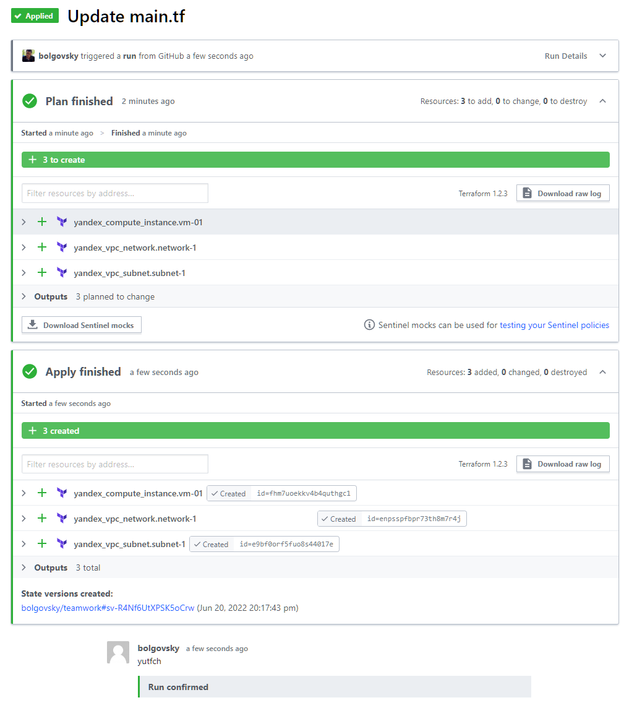
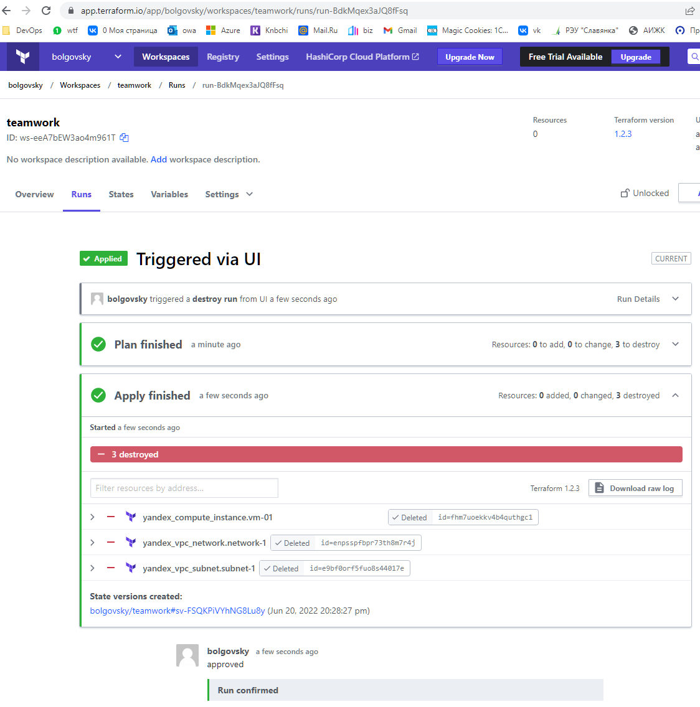
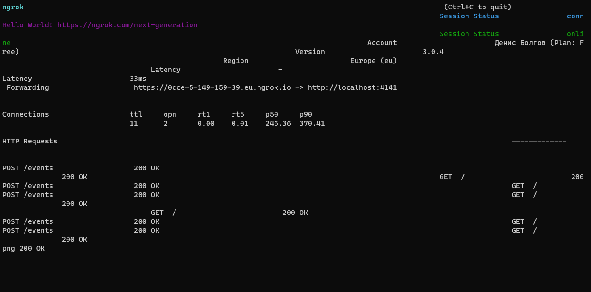
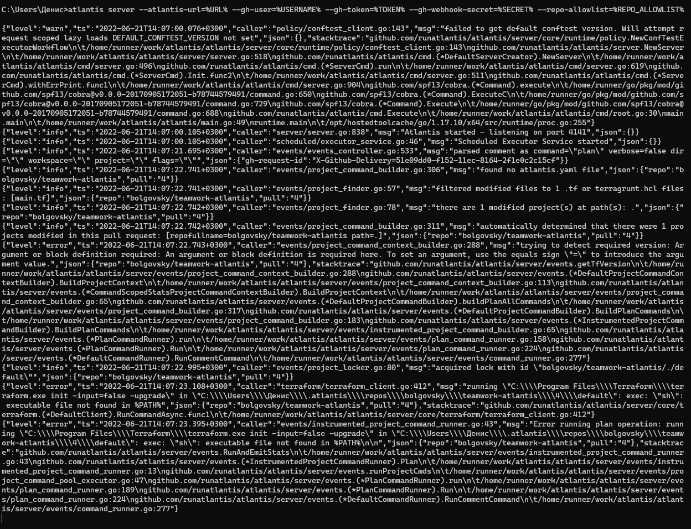
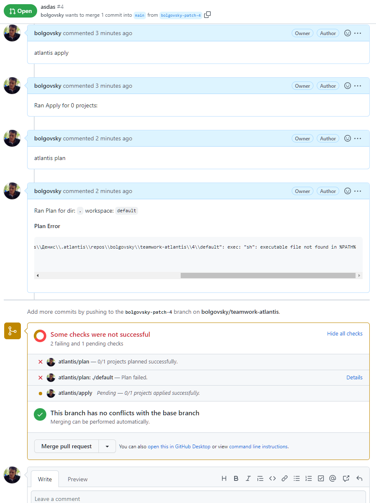
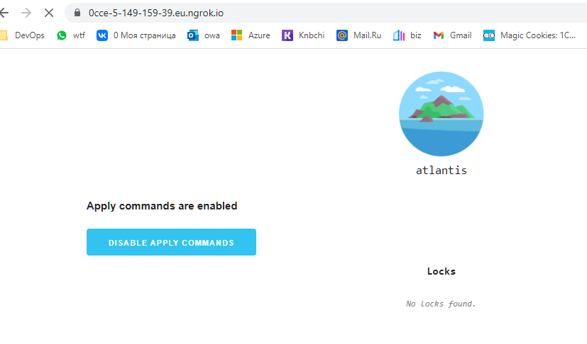
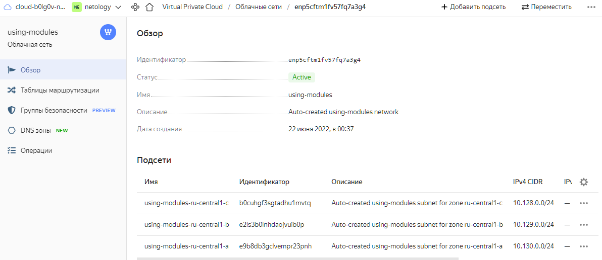

# Домашнее задание к занятию "7.4. Средства командной работы над инфраструктурой."

---

В данном файле приведены **только ответы** ! Т.е. можно искать по **Ответ:**

Задание сделано на **YandexCloud**.

---

## Задача 1. Настроить terraform cloud (необязательно, но крайне желательно).

В это задании предлагается познакомиться со средством командой работы над инфраструктурой предоставляемым
разработчиками терраформа. 

1. Зарегистрируйтесь на [https://app.terraform.io/](https://app.terraform.io/).
(регистрация бесплатная и не требует использования платежных инструментов).
2. Создайте в своем github аккаунте (или другом хранилище репозиториев) отдельный репозиторий с
 конфигурационными файлами прошлых занятий (или воспользуйтесь любым простым конфигом).
3. Зарегистрируйте этот репозиторий в [https://app.terraform.io/](https://app.terraform.io/).
4. Выполните plan и apply. 

В качестве результата задания приложите снимок экрана с успешным применением конфигурации.

**Ответ:** 

Все ресурсы были успешно созданы:


Удаление оказалось не таким очевидным, поэтому помечу себе: [Удаление инфраструктуры в Terraform Cloud](https://learn.hashicorp.com/tutorials/terraform/cloud-destroy)
 



---

## Задача 2. Написать серверный конфиг для атлантиса. 

Смысл задания – познакомиться с документацией 
о [серверной](https://www.runatlantis.io/docs/server-side-repo-config.html) конфигурации и конфигурации уровня 
 [репозитория](https://www.runatlantis.io/docs/repo-level-atlantis-yaml.html).

Создай `server.yaml` который скажет атлантису:
1. Укажите, что атлантис должен работать только для репозиториев в вашем github (или любом другом) аккаунте.
2. На стороне клиентского конфига разрешите изменять `workflow`, то есть для каждого репозитория можно 
будет указать свои дополнительные команды. 
3. В `workflow` используемом по-умолчанию сделайте так, что бы во время планирования не происходил `lock` состояния.

Создай `atlantis.yaml` который, если поместить в корень terraform проекта, скажет атлантису:
1. Надо запускать планирование и аплай для двух воркспейсов `stage` и `prod`.
2. Необходимо включить автопланирование при изменении любых файлов `*.tf`.

В качестве результата приложите ссылку на файлы `server.yaml` и `atlantis.yaml`.

**Ответ:** [server.yaml](https://github.com/bolgovsky/virt-homeworks/blob/master/07-terraform-04-teamwork/src/atlantis/server.yaml) , [atlantis.yaml](https://github.com/bolgovsky/virt-homeworks/blob/master/07-terraform-04-teamwork/src/atlantis/atlantis.yaml)

Более того, получилось даже пощупать (не до победного(надо было использовать не WIN), но тем не менее - смысл стал понятен!)

**Ngrok**


**Atlantis**


**Github**


**NO OUTPUT Atlantis**


**ERROR** - ошибка запуска через sh (в Windows??!?!?) не смог сходу разобраться как победить, кроме использования Linux))

---

## Задача 3. Знакомство с каталогом модулей. 

1. В [каталоге модулей](https://registry.terraform.io/browse/modules) найдите официальный модуль от aws для создания
`ec2` инстансов. 
2. Изучите как устроен модуль. Задумайтесь, будете ли в своем проекте использовать этот модуль или непосредственно 
ресурс `aws_instance` без помощи модуля?
3. В рамках предпоследнего задания был создан ec2 при помощи ресурса `aws_instance`. 
Создайте аналогичный инстанс при помощи найденного модуля.   

В качестве результата задания приложите ссылку на созданный блок конфигураций. 

**Ответ:** задание делалось на YandexCloud, поэтому модуль выбран для него же - [hamnsk/vpc/yandex](https://registry.terraform.io/modules/hamnsk/vpc/yandex/latest)
С оговоркой, что нам тут не инстансы надо одни поднимать, а РАЗОБРАТЬСЯ - поднимем VPC!

```yaml
module "vpc" {
  source  = "hamnsk/vpc/yandex"
  version = "0.5.0"
  yc_cloud_id = "b1g2d742rcmsdqcj615o"
  yc_folder_id = "b1g3jugliqbmg2eomqbj"
  name = "using-modules"
  # insert the 1 required variable here
}
```

В итоге:
```bash
module.vpc.yandex_vpc_subnet.this["ru-central1-b"]: Creating...
module.vpc.yandex_vpc_subnet.this["ru-central1-b"]: Creation complete after 1s [id=e2ls3b0lnhdaojvuib0p]
module.vpc.yandex_vpc_subnet.this["ru-central1-a"]: Creation complete after 2s [id=e9b8db3gclvempr23pnh]
module.vpc.yandex_vpc_subnet.this["ru-central1-c"]: Creation complete after 2s [id=b0cuhgf3sgtadhu1mvtq]

Apply complete! Resources: 4 added, 0 changed, 0 destroyed.
PS C:\Users\Денис\PycharmProjects\virt-homeworks\07-terraform-04-teamwork\src\terraform> terraform destroy
module.vpc.yandex_vpc_network.this: Refreshing state... [id=enp5cftm1fv57fq7a3g4]
module.vpc.yandex_vpc_subnet.this["ru-central1-a"]: Refreshing state... [id=e9b8db3gclvempr23pnh]
module.vpc.yandex_vpc_subnet.this["ru-central1-b"]: Refreshing state... [id=e2ls3b0lnhdaojvuib0p]
module.vpc.yandex_vpc_subnet.this["ru-central1-c"]: Refreshing state... [id=b0cuhgf3sgtadhu1mvtq]
```
В облаке:


Оказалось использовать модули очень удобно и быстро! Жаль, что для YC их придется писать самому))