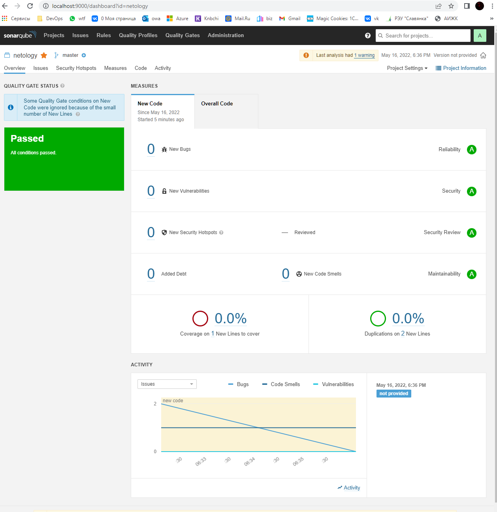

# Домашнее задание к занятию "09.02 CI\CD"

---

В данном файле приведены **только ответы** ! Т.е. можно искать по **Ответ:**

---

## Знакомоство с SonarQube

### Подготовка к выполнению

1. Выполняем `docker pull sonarqube:8.7-community`
2. Выполняем `docker run -d --name sonarqube -e SONAR_ES_BOOTSTRAP_CHECKS_DISABLE=true -p 9000:9000 sonarqube:8.7-community`
3. Ждём запуск, смотрим логи через `docker logs -f sonarqube`
4. Проверяем готовность сервиса через [браузер](http://localhost:9000)
5. Заходим под admin\admin, меняем пароль на свой

В целом, в [этой статье](https://docs.sonarqube.org/latest/setup/install-server/) описаны все варианты установки, включая и docker, но так как нам он нужен разово, то достаточно того набора действий, который я указал выше.

### Основная часть

1. Создаём новый проект, название произвольное
2. Скачиваем пакет sonar-scanner, который нам предлагает скачать сам sonarqube

[Скачать sonar-scanner можно здесь](https://binaries.sonarsource.com/?prefix=Distribution/sonar-scanner-cli/)

3. Делаем так, чтобы binary был доступен через вызов в shell (или меняем переменную PATH или любой другой удобный вам способ)
4. Проверяем `sonar-scanner --version`

```bash
bash-5.0# sonar-scanner --version
INFO: Scanner configuration file: /opt/sonarqube/sonar-scanner-4.7.0.2747-linux/conf/sonar-scanner.properties
INFO: Project root configuration file: NONE
INFO: SonarScanner 4.7.0.2747
INFO: Java 11.0.14.1 Eclipse Adoptium (64-bit)
INFO: Linux 5.10.102.1-microsoft-standard-WSL2 amd64
```

5. Запускаем анализатор против кода из директории [example](./example) с дополнительным ключом `-Dsonar.coverage.exclusions=fail.py`

```bash
sonar-scanner   -Dsonar.projectKey=netology   -Dsonar.sources=.   -Dsonar.host.url=http://localhost:9000   -Dsonar.login=339261588dd64f1437cc1beb67d8e5616151ed17 -Dsonar.coverage.exclusions=fail.py

bash-5.0# sonar-scanner   -Dsonar.projectKey=netology   -Dsonar.sources=.   -Dsonar.host.url=http://localhost:9000   -Dsonar.login=339261588dd64f1437cc1beb67d8e5616151ed17 -Dsonar.coverage.exclusions=fail.py
INFO: Scanner configuration file: /opt/sonarqube/sonar-scanner-4.7.0.2747-linux/conf/sonar-scanner.properties
INFO: Project root configuration file: NONE
INFO: SonarScanner 4.7.0.2747
INFO: Java 11.0.14.1 Eclipse Adoptium (64-bit)
INFO: Linux 5.10.102.1-microsoft-standard-WSL2 amd64
INFO: User cache: /root/.sonar/cache
INFO: Scanner configuration file: /opt/sonarqube/sonar-scanner-4.7.0.2747-linux/conf/sonar-scanner.properties
INFO: Project root configuration file: NONE
INFO: Analyzing on SonarQube server 8.7.1
INFO: Default locale: "en_US", source code encoding: "UTF-8" (analysis is platform dependent)
INFO: Load global settings
INFO: Load global settings (done) | time=118ms
INFO: Server id: BF41A1F2-AYDMnBXopsLIdDL2cUAE
INFO: User cache: /root/.sonar/cache
INFO: Load/download plugins
INFO: Load plugins index
INFO: Load plugins index (done) | time=60ms
INFO: Load/download plugins (done) | time=193ms
INFO: Process project properties
INFO: Process project properties (done) | time=11ms
INFO: Execute project builders
INFO: Execute project builders (done) | time=4ms
INFO: Project key: netology
INFO: Base dir: /opt/sonarqube/example
INFO: Working dir: /opt/sonarqube/example/.scannerwork
INFO: Load project settings for component key: 'netology'
INFO: Load project settings for component key: 'netology' (done) | time=32ms
INFO: Load quality profiles
INFO: Load quality profiles (done) | time=71ms
INFO: Load active rules
INFO: Load active rules (done) | time=1656ms
WARN: SCM provider autodetection failed. Please use "sonar.scm.provider" to define SCM of your project, or disable the SCM Sensor in the project settings.
INFO: Indexing files...
INFO: Project configuration:
INFO:   Excluded sources for coverage: fail.py
INFO: 1 file indexed
INFO: Quality profile for py: Sonar way
INFO: ------------- Run sensors on module netology
INFO: Load metrics repository
INFO: Load metrics repository (done) | time=48ms
INFO: Sensor Python Sensor [python]
INFO: Starting global symbols computation
INFO: 1 source files to be analyzed
INFO: Load project repositories
INFO: Load project repositories (done) | time=26ms
INFO: Starting rules execution
INFO: 1/1 source files have been analyzed
INFO: 1 source files to be analyzed
INFO: 1/1 source files have been analyzed
INFO: Sensor Python Sensor [python] (done) | time=7451ms
INFO: Sensor Cobertura Sensor for Python coverage [python]
INFO: Sensor Cobertura Sensor for Python coverage [python] (done) | time=19ms
INFO: Sensor PythonXUnitSensor [python]
INFO: Sensor PythonXUnitSensor [python] (done) | time=1ms
INFO: Sensor CSS Rules [cssfamily]
INFO: No CSS, PHP, HTML or VueJS files are found in the project. CSS analysis is skipped.
INFO: Sensor CSS Rules [cssfamily] (done) | time=1ms
INFO: Sensor JaCoCo XML Report Importer [jacoco]
INFO: 'sonar.coverage.jacoco.xmlReportPaths' is not defined. Using default locations: target/site/jacoco/jacoco.xml,target/site/jacoco-it/jacoco.xml,build/reports/jacoco/test/jacocoTestReport.xml
INFO: No report imported, no coverage information will be imported by JaCoCo XML Report Importer
INFO: Sensor JaCoCo XML Report Importer [jacoco] (done) | time=6ms
INFO: Sensor C# Properties [csharp]
INFO: Sensor C# Properties [csharp] (done) | time=3ms
INFO: Sensor JavaXmlSensor [java]
INFO: Sensor JavaXmlSensor [java] (done) | time=2ms
INFO: Sensor HTML [web]
INFO: Sensor HTML [web] (done) | time=6ms
INFO: Sensor VB.NET Properties [vbnet]
INFO: Sensor VB.NET Properties [vbnet] (done) | time=2ms
INFO: ------------- Run sensors on project
INFO: Sensor Zero Coverage Sensor
INFO: Sensor Zero Coverage Sensor (done) | time=0ms
INFO: SCM Publisher No SCM system was detected. You can use the 'sonar.scm.provider' property to explicitly specify it.
INFO: CPD Executor Calculating CPD for 1 file
INFO: CPD Executor CPD calculation finished (done) | time=19ms
INFO: Analysis report generated in 146ms, dir size=91 KB
INFO: Analysis report compressed in 30ms, zip size=12 KB
INFO: Analysis report uploaded in 210ms
INFO: ANALYSIS SUCCESSFUL, you can browse http://localhost:9000/dashboard?id=netology
INFO: Note that you will be able to access the updated dashboard once the server has processed the submitted analysis report
INFO: More about the report processing at http://localhost:9000/api/ce/task?id=AYDNikFbpsLIdDL2cY_X
INFO: Analysis total time: 12.089 s
INFO: ------------------------------------------------------------------------
INFO: EXECUTION SUCCESS
INFO: ------------------------------------------------------------------------
INFO: Total time: 14.199s
INFO: Final Memory: 6M/27M
INFO: ------------------------------------------------------------------------
```

6. [Смотрим результат в интерфейсе](./img/bugs.PNG)
7. Исправляем ошибки, которые он выявил(включая warnings)
8. Запускаем анализатор повторно - проверяем, что QG пройдены успешно
9. Делаем скриншот успешного прохождения анализа, прикладываем к решению ДЗ

**Ответ:** 


---

## Знакомство с Nexus

### Подготовка к выполнению

1. Выполняем `docker pull sonatype/nexus3`
2. Выполняем `docker run -d -p 8081:8081 --name nexus sonatype/nexus3`
3. Ждём запуск, смотрим логи через `docker logs -f nexus`
4. Проверяем готовность сервиса через [бразуер](http://localhost:8081)
5. Узнаём пароль от admin через `docker exec -it nexus /bin/bash`
6. Подключаемся под админом, меняем пароль, сохраняем анонимный доступ

### Основная часть

1. В репозиторий `maven-public` загружаем артефакт с GAV параметрами:
   1. groupId: netology
   2. artifactId: java
   3. version: 8_282
   4. classifier: distrib
   5. type: tar.gz
2. В него же загружаем такой же артефакт, но с version: 8_102
3. Проверяем, что все файлы загрузились успешно
4. В ответе присылаем файл `maven-metadata.xml` для этого артефекта

**Ответ:** 
[maven-metadata.xml](./maven-metadata.xml)


---

### Знакомство с Maven

### Подготовка к выполнению

1. Скачиваем дистрибутив с [maven](https://maven.apache.org/download.cgi)

Переместим файл в контейнер:
```bash 
docker cp apache-maven-3.8.5-bin.tar.gz 98ed7ded3c151d46d36b44e8085c7584cf4bf0fb4cfae71f216333faac199b53:/nexus-data/
```

2. Разархивируем, делаем так, чтобы binary был доступен через вызов в shell (или меняем переменную PATH или любой другой удобный вам способ)

```bash 
bash-4.4$ tar -xvzf apache-maven-3.8.5-bin.tar.gz
```

3. Проверяем `mvn --version`
```bash
bash-4.4$ mvn --version
Apache Maven 3.8.5 (3599d3414f046de2324203b78ddcf9b5e4388aa0)
Maven home: /nexus-data/apache-maven-3.8.5
Java version: 1.8.0_282, vendor: Red Hat, Inc., runtime: /usr/lib/jvm/java-1.8.0-openjdk-1.8.0.282.b08-2.el8_3.x86_64/jre
Default locale: en_US, platform encoding: ANSI_X3.4-1968
OS name: "linux", version: "5.10.102.1-microsoft-standard-wsl2", arch: "amd64", family: "unix"
```
4. Забираем директорию [mvn](./mvn) с pom


### Основная часть

1. Меняем в `pom.xml` блок с зависимостями под наш артефакт из первого пункта задания для Nexus (java с версией 8_282)


Для этого необходимо использовать root)) 
```bash 
docker exec -u 0 -it 98ed7ded3c151d46d36b44e8085c7584cf4bf0fb4cfae71f216333faac199b53 /bin/bash
```


```bash 
[root@98ed7ded3c15 mvn]# cat pom.xml
<project xmlns="http://maven.apache.org/POM/4.0.0" xmlns:xsi="http://www.w3.org/2001/XMLSchema-instance"
  xsi:schemaLocation="http://maven.apache.org/POM/4.0.0 http://maven.apache.org/xsd/maven-4.0.0.xsd">
  <modelVersion>4.0.0</modelVersion>

  <groupId>com.netology.app</groupId>
  <artifactId>simple-app</artifactId>
  <version>1.0-SNAPSHOT</version>
   <repositories>
    <repository>
      <id>my-repo</id>
      <name>maven-public</name>
      <url>http://localhost:8081/repository/maven-public/</url>
    </repository>
  </repositories>
  <dependencies>
<!--     <dependency>
      <groupId>netology</groupId>
      <artifactId>java</artifactId>
      <version>8_282</version>
      <classifier>distrib</classifier>
      <type>tar.gz</type>
    </dependency> -->
  </dependencies>
</project>
```

2. Запускаем команду `mvn package` в директории с `pom.xml`, ожидаем успешного окончания

```bash
[root@98ed7ded3c15 mvn]# mvn package
[INFO] Scanning for projects...
[INFO]
[INFO] --------------------< com.netology.app:simple-app >---------------------
[INFO] Building simple-app 1.0-SNAPSHOT
[INFO] --------------------------------[ jar ]---------------------------------
Downloading from central: https://repo.maven.apache.org/maven2/org/apache/maven/plugins/maven-resources-plugin/2.6/maven-resources-plugin-2.6.pom
Downloaded from central: https://repo.maven.apache.org/maven2/org/apache/maven/plugins/maven-resources-plugin/2.6/maven-resources-plugin-2.6.pom (8.1 kB at 8.5 kB/s)
Downloading from central: https://repo.maven.apache.org/maven2/org/apache/maven/plugins/maven-plugins/23/maven-plugins-23.pom
Downloaded from central: https://repo.maven.apache.org/maven2/org/apache/maven/plugins/maven-plugins/23/maven-plugins-23.pom (9.2 kB at 106 kB/s)
Downloading from central: https://repo.maven.apache.org/maven2/org/apache/maven/maven-parent/22/maven-parent-22.pom
...
[WARNING] JAR will be empty - no content was marked for inclusion!
[INFO] Building jar: /nexus-data/mvn/target/simple-app-1.0-SNAPSHOT.jar
[INFO] ------------------------------------------------------------------------
[INFO] BUILD SUCCESS
[INFO] ------------------------------------------------------------------------
[INFO] Total time:  30.942 s
[INFO] Finished at: 2022-05-16T17:24:34Z
[INFO] ------------------------------------------------------------------------
```

3. Проверяем директорию `~/.m2/repository/`, находим наш артефакт

```bash 
[root@98ed7ded3c15 mvn]# ls -lha ~/.m2/repository/
total 44K
drwxr-xr-x 11 root root 4.0K May 16 17:24 .
drwxr-xr-x  3 root root 4.0K May 16 17:24 ..
drwxr-xr-x  3 root root 4.0K May 16 17:24 backport-util-concurrent
drwxr-xr-x  3 root root 4.0K May 16 17:24 classworlds
drwxr-xr-x  3 root root 4.0K May 16 17:24 com
drwxr-xr-x  3 root root 4.0K May 16 17:24 commons-cli
drwxr-xr-x  3 root root 4.0K May 16 17:24 commons-lang
drwxr-xr-x  3 root root 4.0K May 16 17:24 commons-logging
drwxr-xr-x  3 root root 4.0K May 16 17:24 junit
drwxr-xr-x  3 root root 4.0K May 16 17:24 log4j
drwxr-xr-x  6 root root 4.0K May 16 17:24 org
```

В папке `mvn` появилось:

```bash 
[root@98ed7ded3c15 mvn]# ls -lha target/
total 16K
drwxr-xr-x 3 root root 4.0K May 16 17:24 .
drwxr-xr-x 3 root root 4.0K May 16 17:24 ..
drwxr-xr-x 2 root root 4.0K May 16 17:24 maven-archiver
-rw-r--r-- 1 root root 1.6K May 16 17:24 simple-app-1.0-SNAPSHOT.jar
[root@98ed7ded3c15 mvn]# ls -lha target/maven-archiver/
total 12K
drwxr-xr-x 2 root root 4.0K May 16 17:24 .
drwxr-xr-x 3 root root 4.0K May 16 17:24 ..
-rw-r--r-- 1 root root  118 May 16 17:24 pom.properties
```

4. В ответе присылаем исправленный файл `pom.xml`

**Ответ:** 
[Исправленный файл](./mvn/pom.xml)